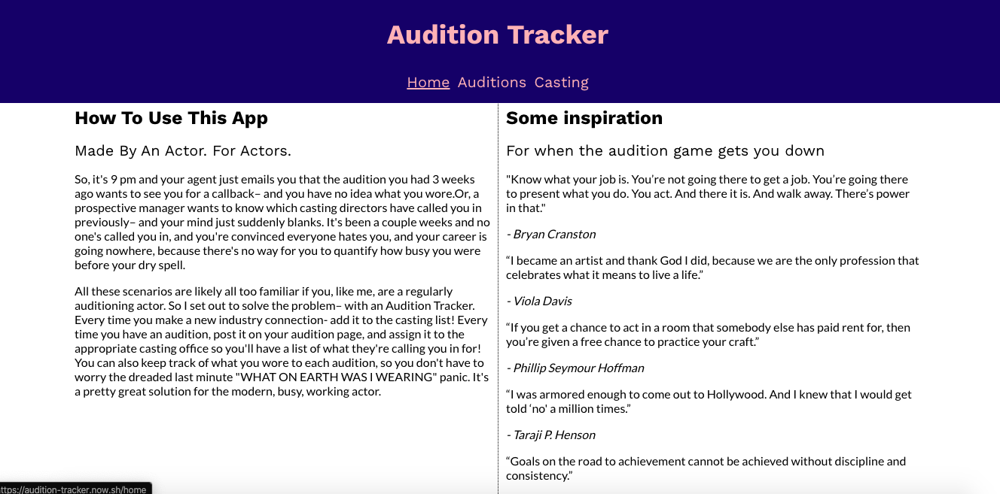
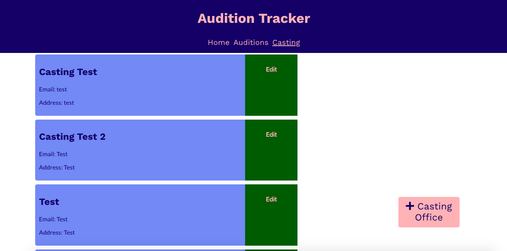
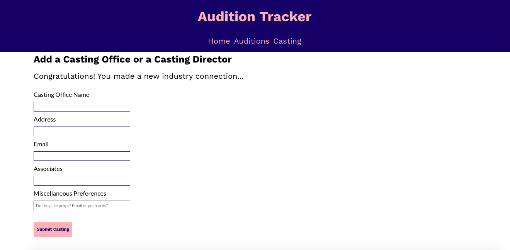
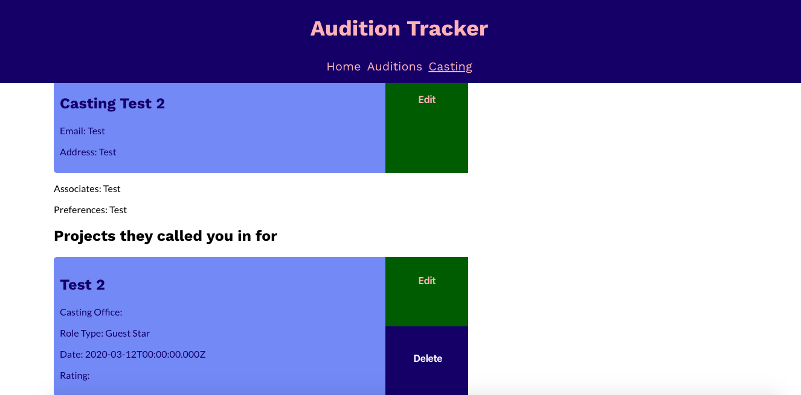
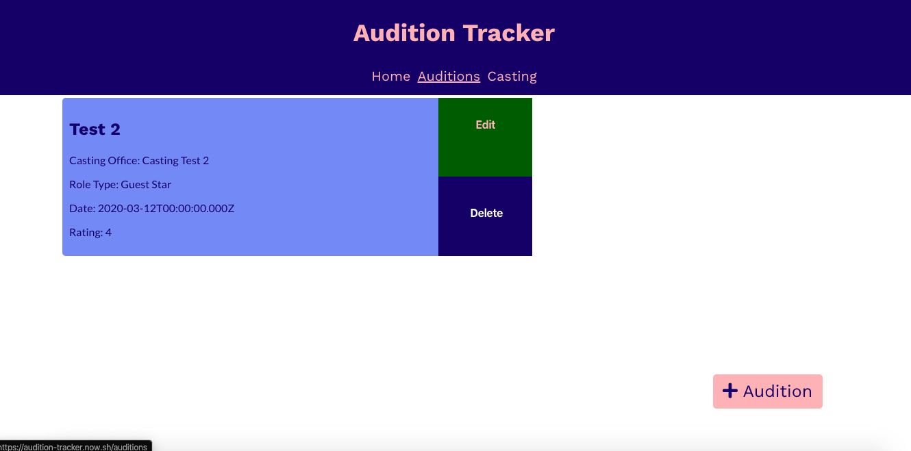
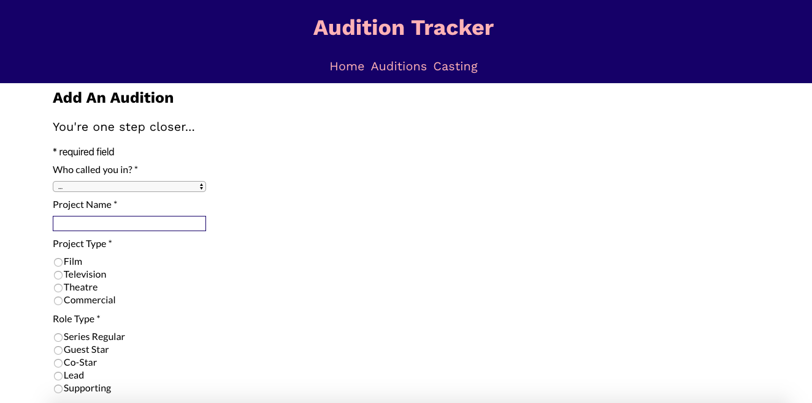
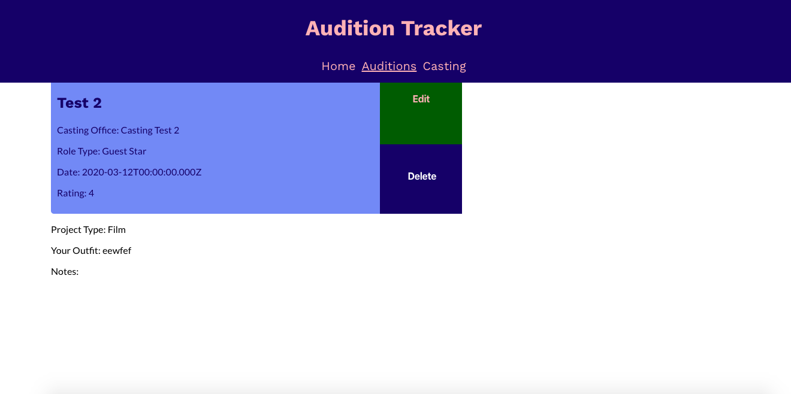

AUDITION TRACKER
================

Link to Live Website
--------------------
https://audition-tracker.now.sh/

About the App
-------------
## Made By An Actor. For Actors.
So, it's 9 pm and your agent just emails you that the audition you had 3 weeks ago wants to see you for a callback– and you have no idea what you wore.Or, a prospective manager wants to know which casting directors have called you in previously– and your mind just suddenly blanks. It's been a couple weeks and no one's called you in, and you're convinced everyone hates you, and your career is going nowhere, because there's no way for you to quantify how busy you were before your dry spell.

All these scenarios are likely all too familiar if you, like me, are a regularly auditioning actor. So I set out to solve the problem– with an Audition Tracker.

Peep all that great inspiration on the right! 

Click on the Casting tab in the navbar– you'll see all your industry connections with all their contact info:

Every time you make a new industry connection- add it to the casting list, by clicking on the "+ Casting Office" button:

You can see which auditions a casting office has called you in for by clicking on their box:

Then under the Auditions tab on the Navbar you'll see all your auditions:

 
Every time you have an audition, post it on your audition page by clicking the "+Audition" button. It's required to assign every audition to the appropriate Casting Office, so if it's a new office, remember to add their info first, as detailed above:

You can also keep track of what you wore to each audition (so you don't have to worry the dreaded last minute "WHAT ON EARTH WAS I WEARING" panic) and other info– just click on the audition and you'll pull up all its info:

API Documentation
-----------------

## Demo Account
Username: test_user
Password: Testtest@123

## Authentication 
Log in with your account at https://audition-tracker.now.sh/ or sign up for an account at https://audition-tracker.now.sh/signup. The app uses automatically generated API bearer tokens to authenticate your credentials and allow you to access your data.

## Endpoints

*Endpoints Without Authentication*

POST '/api/users' - Post a new user 

POST '/api/auth/login' - Authenticate log in

*Endpoints With Authentication*

GET '/api/auditions' - Gets all auditions of a user

POST '/api/auditions' - Posts a new audition

GET '/api/auditoins/:auditionId' - Get an audition by ID

DELETE '/api/auditoins/:auditionId' - Delete audition with the ID

PATCH '/api/auditions/:auditionId' - Update audition with the ID

GET '/api/casting' - Gets all casting of a user

POST '/api/casting' - Posts a new casting director/office

GET '/api/casting/:castingId' - Gets a particular casting by ID

PATCH '/api/casting/:castingId' - Deletes casting with the ID

## Errors
The API uses conventional HTTP response codes for error signalling. Common error codes are as follows:

200- OK 

400- Bad request, often due to missing parameter

401- Unauthorized, no valid API key. Log back in with credentials or sign up for an account if you don't have one.

403- Forbidden, your API key doesn't have the credentials to perform this request

404- Not found, bad endpoint. Check for typos.

500, 502, 503, 504 - Server Errors	Something went wrong on the API's end.

Tech Used
---------
Client: ReactJS, React Router, JSX, Javascript, JSON, HTML, CSS

API: Javascript, Node, Express, JWT Authentication, RESTful APIs, Helmet, XSS, Morgan, Postgres, PSQL, DBeaver, CORS, knex, Chai 